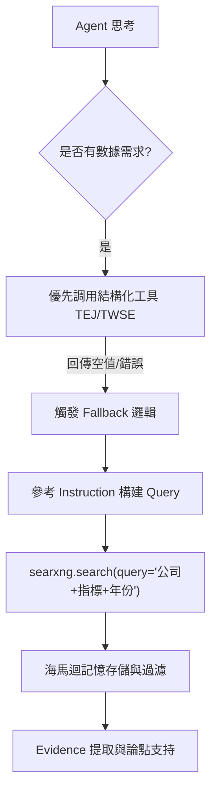

# 辯論系統：搜尋查詢 (Query) 形成邏輯技術分析報告

本文件旨在分析 `agentscope_debate` 系統中，Agent 如何形成搜尋查詢（Query）以及中立核查階段的錯誤觸發機制。

---

## 1. 搜尋查詢 (Query) 形成機制

搜尋查詢的形成並非固定代碼，而是由 **LLM (Large Language Model)** 根據系統注入的上下文動態推理而成。

### 1.1 核心約束：系統提示詞規範
在 `prompts/system/debater_instruction.yaml` 中，定義了搜尋 Query 的構建規範：

*   **優化模板**：要求 Agent 使用「代號 + 時間 + 關鍵指標 + 趨勢」的組合。
    *   *正確範例*：`"2330.TW 2024 Q4 營收 YoY"`
    *   *錯誤範例*：`"2330"` (過於模糊)
*   **Fallback 觸發**：當 `tej.*` 等結構化數據工具回傳空值時，系統會顯示 `Data Honesty` 警告，強制 Agent 轉向 `searxng.search` 尋找替代證據。

### 1.2 動態注入的上下文 (Context Injection)
`worker/debate_cycle.py` 會在每次 Agent 回合中注入以下變數，直接影響 Query 的品質：
*   **`topic_decree`**：鎖定的公司名稱、代碼與特定產業。
*   **`latest_db_date`**：資料庫數據截止日期，引導 Agent 針對「缺口時段」進行搜尋。
*   **`current_date`**：當前系統日期，確保搜尋結果具備時效性。

### 1.3 專屬角色邏輯 (以供應鏈偵探為例)
不同角色 (Agent) 會根據其專業屬性調整搜尋策略：
*   **供應鏈偵探 (Industry Researcher)**：聚焦於 `Industry Cycle` (景氣循環) 與 `Forensic Audit` (審計)。
*   **Query 特色**：偏好使用 `Inventory Days` (庫存週轉)、`ROIC`、`Narrative Deviation` (敘事偏差) 等專業詞彙進行深度檢索。

---

## 2. 中立核查 (Neutral Fact-Check) 錯誤分析

### 2.1 錯誤訊息：`FAIL: 無效產業/代碼`
當日誌顯示此訊息時，代表中立團隊 (Neutral Agent) 在執行 [`_conduct_neutral_fact_check`](worker/debate_cycle.py:724) 時發現了事實不符。

#### 觸發流程：
1.  **主席生成 Decree**：主席在賽前分析中識別出公司與產業。
2.  **中立團隊驗證**：中立 Agent 調用 `tej.company_info` 或搜尋工具核實該代碼。
3.  **判定不一致**：如果主席說 8942 是「電子業」，但工具回傳為「金屬建材」，Agent 會輸出 `FAIL` 並給出修正建議。

### 2.2 錯誤訊息：`Unknown (Unknown)`
這通常發生在主席分析階段 ([`pre_debate_analysis`](worker/debate_cycle.py:384))。
*   **原因**：辯題太模糊（例如：\"談談未來趨勢\"，未指明公司）或 LLM 無法提取出有效的股票代碼。
*   **結果**：後續所有流程會繼承這個 `Unknown` 狀態，導致事實核查直接失敗。

---

## 3. 搜尋執行流圖

---

## 4. 改善建議

1.  **加強主席前測**：在 `pre_analysis` 階段增加對股票代碼存在性的預檢閱。
2.  **Query 隨機化/多樣化**：在 Prompt 中鼓勵 Agent 嘗試多組關鍵字，避免在同一個失效的查詢上反覆重試。
3.  **時效性檢查**：加強對搜尋結果中「日期實體」的提取，以符合「大憲章」對數據時效性的嚴格要求。
