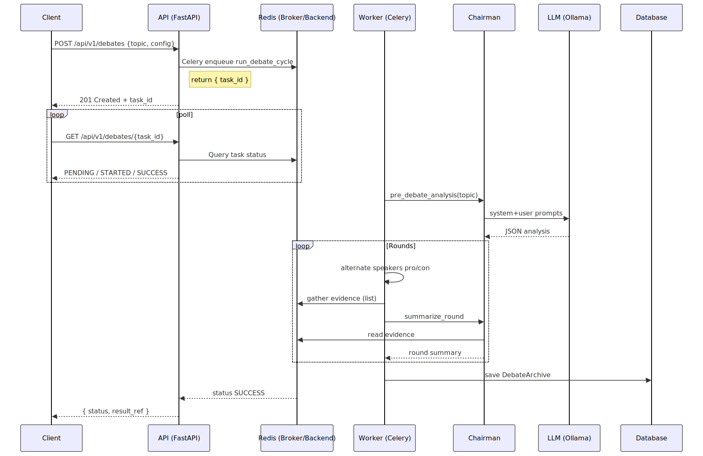

# AgentScope 自動化 AI 辯論平台

[](https://github.com/loeb-ift/agentscope_debate/actions/workflows/ci.yml)

這是一個基於 AgentScope 框架開發的自動化 AI 辯論平台，支援多個 AI 代理針對特定主題進行結構化辯論，並整合多種外部工具來增強論點質量。

## 🎯 平台特色

- **多代理辯論**: 支援正方、反方、中立方多團隊辯論模式
- **即時資訊檢索**: 整合 SearXNG、DuckDuckGo、YFinance 等搜尋工具
- **金融資料支援**: 整合 TEJ 台灣經濟新報資料庫，提供專業金融數據
- **即時串流**: 透過 Server-Sent Events (SSE) 提供即時辯論進度
- **評分機制**: 自動評分系統，追蹤各方論點質量
- **合規審核**: 內建 Guardrail Agent 與 Base Contract，防止幻覺與錯誤推論
- **Web 介面**: 直觀的 Gradio 前端介面，便於操作與監控

## 🏗️ 系統架構

### 架構圖


### 辯論流程圖


### 資料庫 ERD


## 📦 核心組件

### 後端服務
- **API Service (FastAPI)**: RESTful API 服務，處理辯論創建、查詢和管理
- **Worker Service (Celery)**: 非同步任務處理，執行辯論邏輯和代理交互
- **Guardrail Service**: 專職的合規審查服務，攔截違規輸出
- **Redis**: 訊息代理、結果後端、快取和 Pub/Sub 即時串流
- **SearXNG**: 隱私保護的搜尋引擎，提供外部資訊查詢
- **SQLite 資料庫**: 儲存辯論歷史記錄和歸檔資料

### 前端介面
- **Gradio Web App**: 直觀的 Web 介面，支援辯論配置和即時監控
- **即時狀態更新**: 自動輪詢和 SSE 串流顯示辯論進度

### 工具整合 (Toolset Ecosystem)
- **數據運算 (ODS/OSU)**: 底層量化運算服務，處理 CSV 並產出統計圖表
- **事實查核 (Verifiers)**: 提供 `financial.get_verified_price` 進行多源數據驗證，並整合 `pandas-ta-classic` 技術指標
- **金融套件**: 整合 TEJ 專業數據、TWSE 官方數據、Yahoo Finance、Pandas-DataReader 與 Pandas-TA 技術分析
- **搜尋路由**: 智能分流 Google CSE (高品質) 與 SearXNG (免費) 搜尋
- **實體關係**: 查詢集團母子公司關係與產業鏈上下游

## 🚀 快速開始

本專案已完全容器化，最推薦的啟動方式是使用 Docker Compose。此方法會一次性啟動所有必要的服務，包括 API 後端、Celery Worker、前端介面、Redis 和 SearXNG 搜尋引擎。

### 前置需求
- Docker 20.10+
- Docker Compose 2.0+

### 啟動方式

我們提供兩種啟動方式：**一鍵自動部署（推薦）** 與 **手動逐步啟動**。

#### 1. 🚀 一鍵自動部署 (推薦)
此方式會自動完成：啟動容器 → 初始化資料庫 → 同步提示詞 → 建立工具集 → **執行自動化測試 (Smoke Test)**。

```bash
# 複製專案並進入目錄
git clone <repository-url>
cd agentscope_debate

# 執行部署腳本
bash scripts/tmp_rovodev_first_deploy.sh

## 🧰 Makefile 常用指令
```bash
make bootstrap   # 一鍵部署（compose → init_db → prompts → toolset → seed → smoke）
make up          # 啟動容器
make down        # 停止並清除容器/volume
make test        # 執行 scripts/tests 下所有測試
make smoke       # 執行冒煙測試
make openapi     # 重新生成 openapi.json
```

## ✅ Preflight 檢查
在首次嘗試部署前，建議先執行預檢：
```bash
python scripts/preflight_check.py
```
若有缺少環境或無法連線 Redis，會以 [FAIL]/[WARN] 顯示並返回非零碼。

## 🐳 各系統 Docker 注意事項與常見問題
- macOS（Apple Silicon）
  - 請確保 Docker Desktop 已啟動，且已安裝 QEMU（Docker Desktop 會自動處理多架構）
  - 若遇到 port 被佔用（如 8000），請先關閉佔用程式或修改 docker-compose 暴露的埠
  - 檔案系統快取：首次 compose 會較慢，之後會快很多
- Windows（WSL2 建議）
  - 推薦安裝 Docker Desktop 並啟用 WSL2 整合
  - Git 交換行符差異（CRLF vs LF）可能導致 shell 腳本執行失敗，請在 Git 設定 core.autocrlf=input 或使用 WSL 內執行腳本
  - 若 PowerShell 執行腳本時遇到權限問題，請以 bash 或 WSL 執行
- Linux
  - 需自行安裝 docker 與 docker compose（或使用 Docker Compose V2）
  - 若遇到 permission denied，檢查目前使用者是否在 docker 群組內
  - 防火牆限制可能導致容器無法對外連線，請確認網路政策

常見錯誤排解
- /health 無法通過
  - 使用 `docker compose logs -f api worker` 查看錯誤
  - 確認 .env 設定與必要 API Key 是否存在（或先以最少需求模式跑起）
- openapi.json 無回應
  - 等待服務啟動完成，或檢查依賴的服務（如 Redis）
- Redis 無法連線
  - 若使用 memory cache：設定 `EFFECTIVE_TOOLS_CACHE=memory`
  - 若使用 Redis：確認 REDIS_URL；在本機執行 `redis-cli -u $REDIS_URL PING` 應回覆 PONG
```

#### 2. 🛠️ 手動逐步啟動
如果您需要更精細的控制，可以手動執行以下步驟：

1. **配置環境變數**
   ```bash
   git clone <repository-url>
   cd agentscope_debate
   ```

2. **配置環境變數**
   專案可能需要特定的 API 金鑰或配置。請複製 `.env.example` 檔案來建立您的本地設定：
   ```bash
   cp .env.example .env
   ```
   接著，編輯 `.env` 檔案並填入必要的數值，例如 `TEJ_API_KEY` 或 `OPENAI_API_KEY`。

3. **一鍵啟動所有服務**
   執行以下指令來構建映像檔並在背景啟動所有容器：
   ```bash
   docker-compose up --build -d
   ```
   - `--build`: 強制重新構建映像檔，確保程式碼更新生效。
   - `-d`: 在背景模式 (detached mode) 執行。

4. **運行測試 (可選)**
   ```bash
   python3 -m pytest scripts/tests/test_smoke_api.py
   ```

4. **驗證服務狀態**
   等待約 1-2 分鐘讓所有服務完成初始化後，執行以下指令檢查所有容器是否正常運行：
   ```bash
   docker-compose ps
   ```
   您應該會看到 `api`, `worker`, `web`, `redis`, `searxng` 等服務的狀態為 `running` 或 `up`。
   
   ### ⚙️ 初始化與自動化流程
   系統在部署時會自動執行以下初始化動作，確保環境開箱即用：
   
   1.  **資料庫自動建立**: 啟動時會自動執行 `init_db()`，建立所有必要的資料表。
   2.  **種子資料導入 (Seeding)**: 系統會讀取 `data/seeds/` 下的 JSON 檔案，自動導入初始的公司名冊、證券代碼與專業財務術語。
   3.  **Agent 註冊**: 自動在資料庫中註冊各類專業 Agent (如主席、分析師、審核員)。
   4.  **工具集配置**: 初始化 ToolSet 配置，並根據 `.env` 設定啟用對應的外部適配器。
   
   *如果您需要手動重新初始化，可以在 API 容器中執行：*
   ```bash
   docker-compose exec api python seed_db.py
   ```
   
   ### 服務端口
- **API 服務**: http://localhost:8000
- **Web 前端**: http://localhost:7860
- **SearXNG**: http://localhost:8888

## 📖 API 文件

服務啟動後可透過以下方式存取 API 文件：

- **Swagger UI**: http://localhost:8000/docs - 互動式 API 測試介面
- **ReDoc**: http://localhost:8000/redoc - 易讀的 API 參考文件
- **OpenAPI JSON**: http://localhost:8000/openapi.json

### 主要 API 端點

| 端點 | 方法 | 說明 |
|------|------|------|
| `/api/v1/debates` | POST | 創建新的辯論任務 |
| `/api/v1/debates` | GET | 獲取辯論列表 |
| `/api/v1/debates/{task_id}` | GET | 獲取特定辯論狀態 |
| `/api/v1/debates/{task_id}/stream` | GET | SSE 即時串流辯論進度 |
| `/api/v1/agents` | GET | 獲取代理列表 |
| `/api/v1/tools` | GET | 列出所有可用工具 |
| `/api/v1/toolsets` | GET | 獲取工具集配置 |

## 🛠️ 開發指南

### 專案結構
```
agentscope_debate/
├── api/                 # FastAPI 應用程式 (路由、數據模型、工具註冊)
│   ├── main.py          # 應用程式入口點
│   ├── database.py      # 資料庫連線與初始化
│   ├── tool_registry.py # 工具註冊中心與調用入口
│   └── routes/          # API 分層路由 (debates, agents, tools)
├── worker/              # Celery Worker (辯論邏輯、非同步任務)
│   ├── celery_app.py    # Celery 應用程式設定
│   ├── debate_cycle.py  # 辯論核心狀態機
│   └── tasks.py         # 辯論任務封裝
├── adapters/            # 外部適配器 (工具實作層)
│   ├── financial_ta/    # 整合 pandas-ta-classic (SMA, RSI, MACD)
│   ├── pdr_reader.py    # pandas-datareader (Stooq/FRED 來源)
│   ├── chinatimes/      # 時報資訊數據套件
│   ├── tej_adapter.py   # TEJ 專業數據適配器
│   └── searxng_adapter.py # 搜尋路由與適配
├── web/                 # 前端介面 (Gradio v1/v2)
│   ├── app.py           # Gradio 啟動入口
├── prompts/             # 系統提示詞管理 (YAML 格式)
├── data/                # 數據層 (seeds, staging, logs)
│   ├── seeds/           # 資料庫初始化種子數據
│   └── staging/         # OSU 臨時儲存空間 (CSV, Plots)
├── docs/                # 完整文件庫 (GUIDEs, ARCHITECTURE, PLOTs)
├── scripts/             # 自動化腳本與測試
│   └── tests/           # 系統測試 (Smoke, E2E, Unit)
├── diagrams/            # Mermaid/SVG 架構圖
└── docker-compose.yml  # 多容器編排配置
```

### 執行測試

```bash
# 安裝測試依賴
pip install pytest requests

# 執行端對端測試
python3 -m pytest tests/test_e2e.py

# 執行單元測試
python3 -m pytest tests/unit/
```

### 新增工具適配器

1. 在 `adapters/` 目錄創建新的適配器類別
2. 實作 `ToolAdapter` 介面
3. 在 `api/main.py` 和 `worker/celery_app.py` 中註冊適配器
4. 更新 API 文件說明

## 📊 功能特性

### 辯論管理
- **多輪次辯論**: 支援可配置的辯論輪次
- **交叉質詢**: 啟用/禁用交叉質詢功能
- **團隊配置**: 靈活的團隊和代理分配
- **即時評分**: 自動評分和論點質量追蹤

### 代理系統
- **角色定義**: 主席、辯手、專家等不同角色
- **專業領域**: 針對不同主題配置專業代理
- **系統提示**: 可自定義的系統提示詞
- **配置管理**: 靈活的代理配置管理
- **行為約束**: 透過 Base Contract 強制約束 Agent 行為邊界
- **主席戰略引導**: 主席分析結果將直接注入其他 Agent，用於：
  - **戰場劃定**: 限制辯論邊界與關鍵指標
  - **情報同步**: 共享背景調查結果，避免資訊落差
  - **時間錨定**: 統一資料庫有效時間，防止幻覺
  - **論證標準**: 設定高分審查框架（如必須包含 CAPM）

### 工具與數據生態 (Toolset & OSU)

本平台採用 **數據與邏輯分離** 的架構，透過 **Operational Storage Unit (OSU)** 確保數據的公信力與處理效能。

#### 1. 工具優先級體系 (Tool Prioritization Hierarchy)
為了確保 Agent 引用數據的公信力並優化成本，系統執行嚴格的 **「內部優先、外部備援、測試最後」** 策略：

| 級別 | 資料來源 | 信任等級 | 治理邏輯 |
| :--- | :--- | :--- | :--- |
| **L1: 核心內部** | `ChinaTimes` (時報資訊) | 🌟🌟🌟🌟🌟 (最高) | **內部特權工具**。擁有最高調用優先權，涵蓋即時報價、K線、與標準化財報。 |
| **L2: 官方與分析** | `TWSE`, `Pandas-DataReader`, `EDA` | 🌟🌟🌟🌟 (高) | **專業驗證層**。用於交叉比對內部數據，或進行深度統計分析與全球宏觀研究。 |
| **L3: 外部檢索** | `SearXNG`, `Browser` | 🌟🌟 (中) | **情報探索層**。受限工具，需主席准核且消耗瀏覽配額，用於獲取非結構化新聞事实。 |
| **L4: 測試工具** | `TEJ` (測試版) | 🌟 (低) | **備援層**。僅在以上來源均無法滿足需求時，作為最後的數據參考點。 |

#### 2. 詳細工具清單
| 模組 | 關鍵工具名稱 | 核心功能 | 優先級 |
| :--- | :--- | :--- | :--- |
| **即時/事實** | `chinatimes.stock_rt` | **[Internal]** 高頻即時報價、成交明細與市場盤中動態 | **最高** |
| **自動化分析** | `chairman.eda_analysis` | 辯論開始時自動拉取數據並生成 EDA 報表 (整合技術指標) | **核心** |
| **數據拉取** | `financial.pdr_reader` | 透過 pandas-datareader (Stooq) 獲取高品質全球股價 (非台股必備) | **專業** |
| **技術分析** | `financial.technical_analysis` | 專為 Agent 設計，提供 RSI/MACD/SMA 等 15+ 種信號摘要 | **專業** |
| **數據運算** | `ods.eda_describe` | 底層 OSU 數據處理，產生統計圖與缺失值分析 | **基礎** |
| **基礎財報** | `tej.financial_summary` | **[Beta]** 僅作備援參考之標準化財報、法人持股 | **最後** |
| **智能檢索** | `search.smart` | 根據角色與題材自動路由至 Google CSE 或 SearXNG | **探索** |
| **網頁瀏覽** | `browser.browse` | **(Gated)** 經主席准核後瀏覽指定網頁，並自動進行摘要優化 | **探索** |
| **集團實體** | `internal.get_industry_tree` | 查詢公司所屬產業鏈與集團關聯實體 | **專業** |

#### 3. OSU 數據流轉邏輯
為了在有限的 Token 限制下處理大量金融數據，系統實作了 **「數據在 OSU 流轉，Agent 在 Context 引用」** 的機制：

1.  **數據攝取 (Ingestion)**: 適配器將抓取的原始數據 (CSV) 存入 OSU 磁碟空間。
2.  **證據註冊**: 系統透過 `EvidenceLifecycle` 為該數據註冊唯一 Evidence ID。
3.  **ODS 分析**: `ods.eda_describe` 讀取 OSU 檔案，產出視覺化圖表與摘要，並更新 Metadata。
4.  **Agent 引用**: Agent 的上下文僅持有證據 ID 與摘要路徑，發言時透過 ID 進行精準引用（如 `[Ref: ev_eda_001]`）。

#### 4. 證據生命週期管理 (Evidence Lifecycle)
系統透過 `worker/evidence_lifecycle.py` 實作了嚴格的證據狀態機，確保數據流轉的透明性：

- **Ingest (寫入)**: 原始數據進入 OSU，建立 `DRAFT` 證據，並透過 `inputs_hash` (MD5) 自動去重。
- **Verify (驗證)**: 執行 **數據誠信檢查 (Data Honesty)**。若數據為空或錯誤則隔離 (`QUARANTINE`)，通過則標記為 `VERIFIED` 並分配 **TTL (生存時間)**。
- **Aging (老化)**: 定期將過期證據轉為 `STALE`，強制 Agent 重新獲取最新市場數據。
- **Citation (引用)**: 透過 `create_checkpoint` 鎖定當前辯論的所有 `VERIFIED` ID，實現「事實錨定」。

#### 5. 高成本工具治理 (Governance Gate)
為了平衡資訊獲取與 API 成本，系統針對高成本工具（如 `browser.browse`）實作了 **「主席准核機制」**：

1.  **申請與理由**: Agent 調用受限工具時，必須在參數中提供 `justification` (理由)。
2.  **主席裁決**: `DebateCycle` 攔截請求並提交給主席 Agent，主席根據邊際效益與辯題關聯性決定 `approve` 或 `reject`。
3.  **記憶優化 (Summarization)**: 瀏覽回傳的龐大內容會自動觸發 **LLM 摘要層**，僅保留精簡事實存入 Agent Context，防止長文本導致的記憶溢出與遺忘。


## 🔧 維護與部署

### 資料庫管理
- 使用 `init_db()` 自動建立資料表
- SQLite 資料庫檔案位於 `instance/` 目錄
- 支援資料庫遷移和版本控制

### 服務監控
```bash
# 查看服務日誌
docker-compose logs api
docker-compose logs worker

# 監控 Celery 任務
celery -A worker.celery_app flower

# 健康檢查
curl http://localhost:8000/health
```

### 效能優化
- Redis 快取機制減少重複查詢
- 非同步任務處理避免阻塞
- 連線池管理資料庫和 Redis 連線
- 記憶體使用監控和優化

## 📝 相關文件

- **專案交付計劃**: [PROJECT_DELIVERY_PLAN_zh-TW.md](PROJECT_DELIVERY_PLAN_zh-TW.md)
- **AI 辯論平台開發指南**: [AI_Debate_Platform_Dev_Guide.md](AI_Debate_Platform_Dev_Guide.md)
- **前端使用指南**: [FRONTEND_USER_GUIDE.md](FRONTEND_USER_GUIDE.md)
- **工具集架構**: [TOOLSET_ARCHITECTURE.md](TOOLSET_ARCHITECTURE.md)
- **TEJ 驗證報告**: [TEJ_VERIFICATION_REPORT.md](TEJ_VERIFICATION_REPORT.md)
- **瀏覽工具治理指南**: [BROWSER_TOOL_GOVERNANCE_GUIDE.md](BROWSER_TOOL_GOVERNANCE_GUIDE.md)

## 🐛 問題回報

如果您遇到任何問題或有功能建議，請透過以下方式回報：

1. 檢查現有問題列表
2. 提供詳細的重現步驟
3. 包含相關的日誌資訊
4. 說明預期行為和實際行為

## 🤝 貢獻指南

我們歡迎任何形式的貢獻！請參閱：
- [CONTRIBUTING.md](agentscope/CONTRIBUTING.md)
- [CONTRIBUTING_zh.md](agentscope/CONTRIBUTING_zh.md)


## 🛠️ Runtime 工具請求審批流程（前端交互草圖）

流程
1. Agent 在對話/任務中需要新的工具（不在 effective 清單中），提出 Runtime Request：
   - POST /api/v1/agents/{id}/runtime-tools/request { tool_name, session_id?, reason }
2. 後台顯示審批隊列（待審批）：
   - GET /api/v1/agents/{id}/runtime-tools/requests
3. 管理員/操作者審批：Approve or Deny
   - Approve: POST /api/v1/agents/{id}/runtime-tools/{request_id}/approve { approved_by }
   - Deny: POST /api/v1/agents/{id}/runtime-tools/{request_id}/deny
4. Agent 重新計算 effective tools（自動快取失效）：
   - GET /api/v1/agents/{id}/tools/effective

前端 UI 交互草圖（示意）
```
[ Agent 設定頁 ]
┌──────────────────────────────────────────────────────────┐
│ Agent: analyst-001                                      │
│ Tabs: 基本資料 | 提示詞 | 工具配置 | 運行請求                       │
│                                                          │
│ 工具配置（Effective Tools）                               │
│  ┌───────────────┬───────────────┬─────────────┬───────┐ │
│  │ 名稱           │ 來源(source)  │ precedence  │ 狀態  │ │
│  ├───────────────┼───────────────┼─────────────┼───────┤ │
│  │ duckduckgo.search │ prompt     │ prompt      │ 可用  │ │
│  │ web.fetch         │ global     │ global      │ 可用  │ │
│  │ ...               │ ...        │ ...         │ ...   │ │
│  └───────────────┴───────────────┴─────────────┴───────┘ │
│  [新增綁定] [解除綁定] [Deny] [Request Runtime Tool]       │
│                                                          │
│ 運行請求（Runtime Requests）                               │
│  ┌──────────────────────────────────────────────────────┐ │
│  │ ID      │ Tool Name        │ Reason           │ 狀態    │ │
│  ├─────────┼──────────────────┼──────────────────┼────────┤ │
│  │ r_123   │ web.fetch        │ need http        │ pending │ │
│  │ r_124   │ duckduckgo.search│ need web search  │ approved│ │
│  └─────────┴──────────────────┴──────────────────┴────────┘ │
│  [Approve] [Deny]                                         │
└──────────────────────────────────────────────────────────┘
```

API 範例
```bash
# 建立 runtime request
curl -sS -X POST \
  http://localhost:8000/api/v1/agents/<AGENT_ID>/runtime-tools/request \
  -H 'Content-Type: application/json' \
  -d '{"tool_name":"duckduckgo.search","reason":"need web search"}' | jq

# 查詢待審批清單
curl -sS http://localhost:8000/api/v1/agents/<AGENT_ID>/runtime-tools/requests | jq

# 通過審批
curl -sS -X POST \
  http://localhost:8000/api/v1/agents/<AGENT_ID>/runtime-tools/<REQUEST_ID>/approve \
  -H 'Content-Type: application/json' \
  -d '{"approved_by":"admin"}' | jq

# 拒絕請求
curl -sS -X POST \
  http://localhost:8000/api/v1/agents/<AGENT_ID>/runtime-tools/<REQUEST_ID>/deny | jq

# 重新取得 Effective Tools（可加上 include_precedence / include_denies）
curl -sS "http://localhost:8000/api/v1/agents/<AGENT_ID>/tools/effective?include_precedence=true" | jq
```

## 🛠️ Agent Effective Tools API

提供查詢智能體「最終可用工具清單」的 API。

Endpoint
```http
GET /api/v1/agents/{agent_id}/tools/effective?include_sources=true&include_precedence=false&include_denies=false
```

參數
- include_sources (boolean, 預設 true):
  - true: 回傳工具並附上來源標籤（source: global/toolset/prompt/runtime）。
  - false: 僅回傳工具字段，不包含來源標籤。
- include_precedence (boolean, 預設 false):
  - true: 額外回傳 precedence 欄位（deny > runtime > prompt > agent_toolset > global）。
- include_denies (boolean, 預設 false):
  - true: 回傳格式改為 { tools: [...], denies: [...] }，denies 列出被拒工具。

說明
- M1：最終清單等同 assigned ∪ global（去重）。
- M2：加入 deny、prompt 限制、runtime 附加與 precedence 規則，並提供快取與失效點。

環境變數（快取）
- EFFECTIVE_TOOLS_CACHE: memory | redis（預設 memory）
- EFFECTIVE_TOOLS_TTL: 整數秒（預設 60）
- EFFECTIVE_TOOLS_PREFIX: Redis key 前綴（預設 as:cache:）

用法示例
```bash
# 預設包含來源
curl -sS "http://localhost:8000/api/v1/agents/<AGENT_ID>/tools/effective" | jq
# 僅回傳純工具欄位
curl -sS "http://localhost:8000/api/v1/agents/<AGENT_ID>/tools/effective?include_sources=false" | jq
# 回傳 precedence 註解
curl -sS "http://localhost:8000/api/v1/agents/<AGENT_ID>/tools/effective?include_precedence=true" | jq
# 回傳被拒工具列表
curl -sS "http://localhost:8000/api/v1/agents/<AGENT_ID>/tools/effective?include_denies=true" | jq
```

## 📄 授權協議

本專案採用 MIT 授權協議 - 詳見 [LICENSE](agentscope/LICENSE) 文件。

## 🙏 致謝

- **AgentScope 團隊**: 提供優秀的多代理框架
- **SearXNG 專案**: 隱私保護的搜尋引擎
- **TEJ 台灣經濟新報**: 專業金融資料支援
- **開源社群**: 所有貢獻者和使用者

---

**版本**: 1.0.0  
**最後更新**: 2025年12月  
**維護者**: AgentScope Debate Platform Team