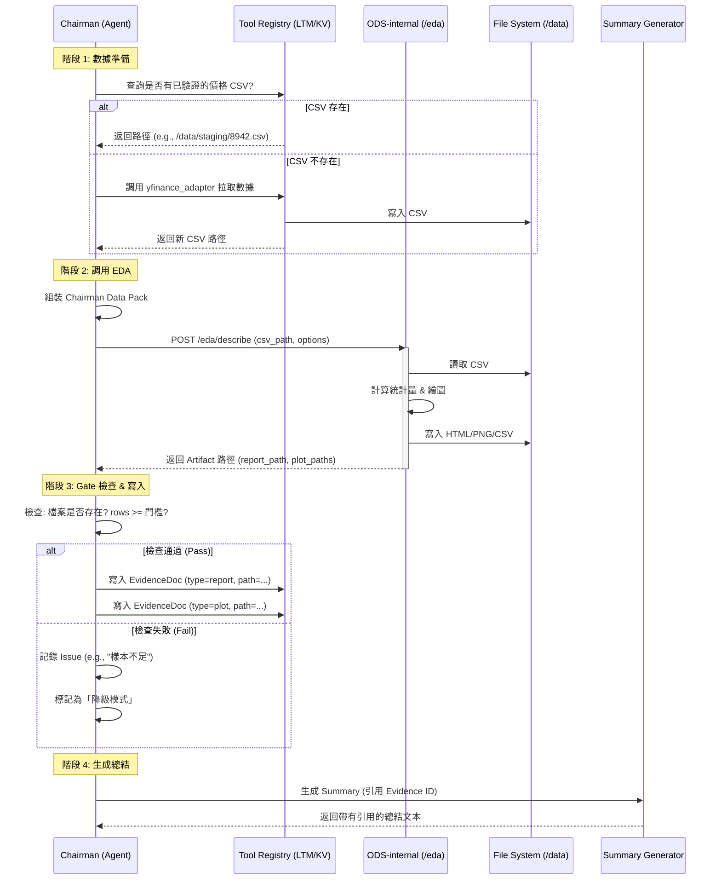

# Chairman EDA & Summary Guide (主席 EDA 與總結自動化指南)

## 1. 概述 (Overview)

本文件定義了「主席 Agent (Chairman)」如何透過自動化 EDA 工具生成實證數據，並將其引用於辯論總結中的標準流程。核心目標是將主席的總結從「純文本生成」轉向「基於驗證數據 (Verified Artifacts) 的實證敘述」。

### 核心原則
1.  **實證優先**：所有引用的統計數據必須來自自動化工具生成的 Verified Artifacts (HTML/PNG/CSV)。
2.  **優雅降級 (Graceful Degradation)**：當數據不足或不可用時，系統不應崩潰，而是記錄原因並降級為定性描述。
3.  **無狀態工具**：EDA 服務 (ODS-internal) 為無狀態設計，僅接收 CSV 路徑與參數，輸出報表與圖檔。

---

## 2. 目標與範圍 (Goals & Scope)

### 目標
由內部工具（ODS-internal）自動執行 EDA，輸出一套可視化與報表（HTML/PNG/CSV），供主席總結引用。

### 範圍 (Iteration 1)
*   **最小可用功能**：描述統計、分布、缺失值、相關矩陣、數值/類別欄位簡表與圖。
*   **輸出格式**：HTML 報表 (`ydata-profiling`) + 關鍵圖表 (PNG) + 摘要 CSV。
*   **輸入**：CSV 檔案路徑（位於 `/data` 下）、可選參數（欄位白名單、樣本截取、語言區域）。

### 非目標 (初期)
*   跨資料表關聯 (Join) 與 SQL 來源直接處理。
*   高度互動式前端 (先以靜態 HTML 為主)。
*   LLM 自動洞察 (留待 Iteration 2+)。

---

## 3. 技術選型 (Tech Stack)

所有工具均部署於內部環境，無需外部金鑰。

*   **報表引擎**：`ydata-profiling` (優先，因成熟穩定) 或 `sweetviz`。
*   **快速可視化**：`autoviz` (用於輔助生成散點、直方、箱型圖)。
*   **互動探索 (Dev Only)**：`dtale` (僅供開發者內部除錯使用，不作為產出)。
*   **API 框架**：FastAPI (ODS-internal)。

---

## 4. API 介面規範 (ODS-internal Interface)

### 4.1 核心描述端點
**Endpoint**: `POST /eda/describe`

用於生成完整的 EDA 報表與基礎圖表。

*   **Request (Input)**:
    ```json
    {
      "csv_path": "/data/staging/8942.csv",
      "include_cols": ["date", "close", "volume"],  // 可選：指定分析欄位
      "sample": 100000,                             // 可選：若列數過多則抽樣
      "lang": "zh"                                  // 可選：報表語言
    }
    ```

*   **Response (Output)**:
    ```json
    {
      "report_path": "/data/reports/{debate_id}/eda_profile.html",
      "plot_paths": [
        "/data/plots/{debate_id}/hist_close.png",
        "/data/plots/{debate_id}/corr_matrix.png",
        "/data/plots/{debate_id}/box_volume.png"
      ],
      "table_paths": [
        "/data/tables/{debate_id}/summary_stats.csv"
      ],
      "meta": {
        "rows": 1250,
        "cols": 5,
        "missing_rate": 0.01,
        "generated_at": "2023-10-27T10:00:00Z",
        "engine": "ydata-profiling"
      }
    }
    ```

### 4.2 快速繪圖端點 (可選)
**Endpoint**: `POST /eda/quickplots`

用於針對性地生成特定圖表。

*   **Request**: `{ "csv_path": "...", "tasks": ["hist", "box", "scatter"] }`
*   **Response**: `{ "plot_paths": [...] }`

---

## 5. Chairman Data Pack 規範

主席在調用 EDA 工具前，需組裝標準化的數據包 (Data Pack)。

```json
{
  "debate_id": "debate_20231027_001",
  "topic": "8942.TWO 投資價值分析",
  "symbols": ["8942.TWO", "2330.TW"],
  "timeframe": {
    "lookback_days": 120,
    "end_date": "2023-10-27"
  },
  "datasets": {
    "prices": [
      {
        "symbol": "8942.TWO",
        "csv_path": "/data/staging/debate_20231027_001/8942.TWO.csv",
        "columns": ["date", "close", "volume", "high", "low"]
      }
    ],
    "fundamentals": [
      {
        "symbol": "8942.TWO",
        "csv_path": "/data/staging/debate_20231027_001/8942.TWO_fund.csv",
        "period": "quarterly"
      }
    ]
  },
  "options": {
    "sample": 50000,
    "lang": "zh",
    "plots": ["hist", "corr"]
  }
}
```

---

## 6. 工作流程與交互 (Workflow)



---

## 7. Gate 與降級策略 (Gating & Degradation)

系統必須具備容錯能力，處理數據缺失或品質不佳的情況。

### 7.1 Gate 檢查規則
1.  **檔案可讀性**：`report_path` 與 `plot_paths` 必須存在且可讀。
2.  **樣本門檻**：資料列數 (`rows`) 必須 >= N (例如 30 筆交易日)，否則視為樣本不足。
3.  **欄位檢查**：必須至少包含一個數值欄位，否則無法繪製分布圖/相關矩陣。
4.  **新鮮度**：Artifact 的 `generated_at` 必須在本次辯論週期內 (或 24h 內)。

### 7.2 降級處置 (Graceful Degradation)
當 Gate 檢查失敗時：
*   **不拋出異常**：流程繼續執行。
*   **記錄原因**：在 `ChairmanDecisionLog` 中記錄失敗原因 (e.g., "8942.TWO fetch failed", "rows < 30")。
*   **替代方案**：
    *   **數值型 EDA** -> **定性描述**：主席改為描述「因數據不足，無法提供量化分析」，並僅引用可用的定性資訊（如新聞摘要）。
    *   **同業比較**：若主標的缺失，可嘗試僅展示同業數據作為參考背景。

---

## 8. 輸出物標準 (Artifacts Standards)

### 8.1 EvidenceDoc (Report)
```json
{
  "id": "evidence_eda_001",
  "type": "report",
  "snippet": "EDA 自動報表 (ydata-profiling), rows=1250, cols=6, missing_rate=0.5%",
  "fulltext_ref": "/data/reports/debate_id/eda_profile.html",
  "provenance": {
    "provider": "ods-internal",
    "task": "eda.describe",
    "params_hash": "a1b2c3...",
    "generated_at": "2023-10-27T10:05:00Z"
  }
}
```

### 8.2 EvidenceDoc (Plots)
```json
{
  "id": "evidence_plot_001",
  "type": "image",
  "snippet": "8942.TWO 收盤價直方圖 (Histogram)",
  "fulltext_ref": "/data/plots/debate_id/hist_close.png"
}
```

### 8.3 BackgroundSummary (Text)
主席生成的總結段落示例：
> 「本輪自動 EDA 已針對 8942.TWO 生成分析報表（樣本數 120 日，缺失率 0%）[E1]。根據直方圖顯示 [E2]，收盤價呈現左偏分布。相關矩陣 [E3] 指出成交量與價格波動無顯著線性相關。」

若降級：
> 「由於 8942.TWO 屬興櫃股票，公開價格序列獲取受限（樣本不足 30 日），本輪暫不提供詳細量化 EDA 報表。建議參考同業 2330.TW 之走勢作為產業背景 [E4]。」

---

## 9. 落地實作計劃

### 迭代 1 (2-3 天)
*   [ ] 建立 `adapters/ods_internal_adapter.py`。
*   [ ] 實作 FastAPI `/eda/describe` 端點，整合 `ydata-profiling`。
*   [ ] 實作 Chairman 的 `pre-summary hook` 邏輯。
*   [ ] 實作基礎 Gate 檢查 (檔案存在、樣本數)。

### 迭代 2 (2-3 天)
*   [ ] 增加 `/eda/quickplots` 端點。
*   [ ] 引入 `BackgroundSummary` 自動生成模板。
*   [ ] 前端整合：在聊天介面顯示 HTML 報表連結與縮圖。

### 迭代 3 (>3 天)
*   [ ] 引入 LLM (PandasAI / LangChain Agents) 進行自然語言洞察。
*   [ ] 增加進階金融指標 (波動率、Z-Score)。
*   [ ] 支援互動式圖表 (Plotly JSON)。
