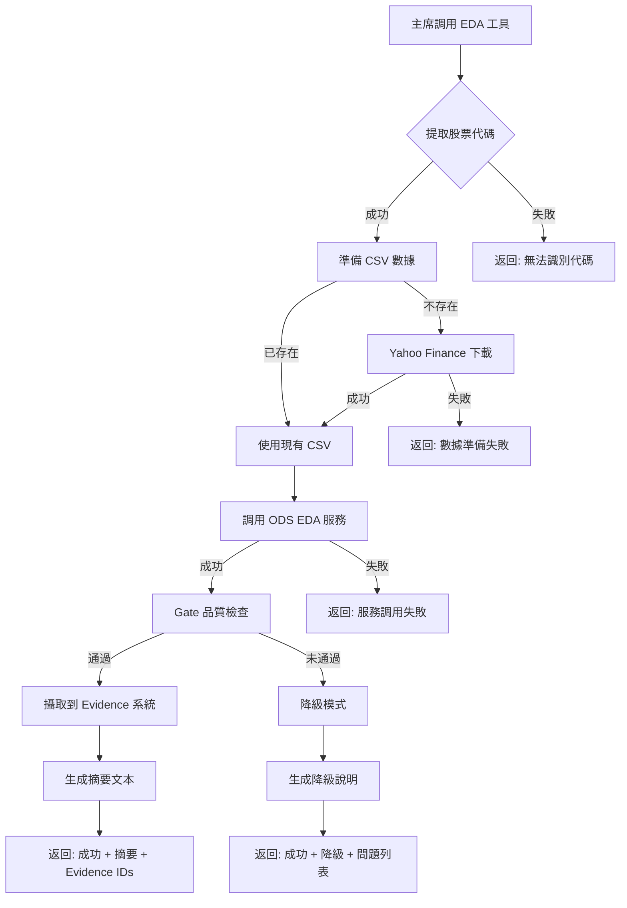

# 主席 EDA 工具使用指南

## 工具概述

**工具名稱**: `chairman.eda_analysis`  
**版本**: v1  
**權限**: 僅供主席使用  
**用途**: 自動化探索性數據分析 (Exploratory Data Analysis)

## 工具功能

這是一個**高階整合工具**，一次調用即可完成：

1. ✅ 自動拉取股票歷史數據（Yahoo Finance）
2. ✅ 生成完整 EDA 報表（ydata-profiling）
3. ✅ 產生統計圖表（直方圖、相關矩陣、箱型圖）
4. ✅ 品質檢查與驗證（Gate Check）
5. ✅ 自動攝取到 Evidence 系統（VERIFIED 狀態）

---

## 輸入參數

### 必填參數

| 參數 | 類型 | 說明 | 範例 |
|------|------|------|------|
| `symbol` | string | 股票代碼 | `"2330.TW"`, `"AAPL"` |
| `debate_id` | string | 辯論 ID（用於數據隔離） | `"debate_001"` |

### 可選參數

| 參數 | 類型 | 預設值 | 說明 |
|------|------|--------|------|
| `lookback_days` | integer | 120 | 回溯天數 |
| `include_financials` | boolean | True | 是否包含財務報表分析（**新增**） |

---

## 輸出結果

### 成功情境（正常模式 + 財務數據）

```json
{
  "success": true,
  "degraded": false,
  "summary": "### EDA 自動分析報告\n\n**分析標的**: 2330.TW\n**數據期間**: 83 個交易日\n\n**價格分析**:\n...\n\n**基本面分析**:\n- EPS（每股盈餘）: $8.50\n- ROE（股東權益報酬率）: 25.60%\n- 本益比 (P/E): 22.50x\n\n**財務健康度**:\n- 負債比率: 35.20% (健康)\n- 流動比率: 1.80 (良好)\n...",
  "evidence_ids": [
    "abc-123-def",
    "abc-124-def"
  ],
  "artifacts": {
    "report": "/path/to/eda_profile.html",
    "plots": [...],
    "tables": [...]
  },
  "financial_data": {
    "success": true,
    "fundamental": {
      "eps": 8.5,
      "roe": 25.6,
      "pe_ratio": 22.5
    },
    "ratios": {
      "debt_ratio": 35.2,
      "current_ratio": 1.8
    }
  }
}
```

### 成功情境（降級模式）

當品質檢查未通過時，工具仍會返回成功，但標記為降級模式：

```json
{
  "success": true,
  "degraded": true,
  "summary": "EDA 分析完成（降級模式）\n\n⚠️ EDA 自動分析未能通過品質檢查，原因如下：\n1. 樣本數不足：僅有 20 筆，需要至少 30 筆\n\n建議：本輪將採用定性描述，不提供詳細量化分析。",
  "issues": [
    "樣本數不足：僅有 20 筆，需要至少 30 筆"
  ]
}
```

### 失敗情境

```json
{
  "success": false,
  "error": "數據準備失敗：無法下載股票數據"
}
```

---

## 主席調用範例

### 場景 1: 在總結時自動調用

```python
async def summarize_debate(self, debate_id: str, topic: str, rounds_data: list, handcard: str = "") -> str:
    # 從 topic 提取股票代碼
    stock_codes = self._extract_stock_codes_from_topic(topic, handcard)
    
    if stock_codes:
        symbol = stock_codes[0]  # 使用第一個識別到的代碼
        
        # 調用 EDA 工具
        from worker.tool_invoker import call_tool
        
        result = await loop.run_in_executor(
            None, 
            call_tool, 
            "chairman.eda_analysis", 
            {
                "symbol": symbol,
                "debate_id": debate_id,
                "lookback_days": 120
            }
        )
        
        # 處理結果
        if result.get("success"):
            eda_summary = result.get("summary", "")
            # 將 eda_summary 注入到總結 prompt 中
        else:
            # 降級處理：不使用 EDA 數據
            eda_summary = "(未進行 EDA 分析)"
```

### 場景 2: LLM 主動調用（未來擴展）

如果未來允許 LLM 自主選擇工具，主席可以這樣調用：

```json
{
  "tool": "chairman.eda_analysis",
  "params": {
    "symbol": "2330.TW",
    "debate_id": "debate_001"
  }
}
```

---

## 工作流程圖



---

## Evidence 系統整合

### 自動攝取的 Evidence 類型

1. **HTML 報表** (`artifact_type: "report"`)
   - 完整的 ydata-profiling 報表
   - Trust Score: 90
   - Status: VERIFIED

2. **統計圖表** (`artifact_type: "plot"`)
   - 直方圖 (hist_distributions.png)
   - 相關矩陣 (corr_matrix.png)
   - 箱型圖 (box_plots.png)
   - Trust Score: 90
   - Status: VERIFIED

3. **摘要表格** (`artifact_type: "table"`)
   - 統計摘要 CSV (summary_stats.csv)
   - Trust Score: 90
   - Status: VERIFIED

### Evidence 引用範例

在主席總結中，可以這樣引用：

```markdown
根據 EDA 自動分析 [E1]，台積電 (2330.TW) 在過去 120 天的表現如下：

- 平均收盤價：$950.25
- 價格波動率：4.5%
- 成交量趨勢：穩定

如價格分布圖 [E2] 所示，股價呈現右偏分布，顯示整體上漲趨勢。

**Evidence 引用**:
- [E1] REPORT (ID: abc-123-def)
- [E2] PLOT (ID: abc-124-def)
- [E3] PLOT (ID: abc-125-def)
```

---

## 品質檢查標準

### Gate Check 項目

| 檢查項目 | 標準 | 失敗影響 |
|----------|------|----------|
| 檔案可讀性 | 所有 artifacts 必須存在且可讀 | 降級 |
| 樣本門檻 | 至少 30 筆數據 | 降級 |
| 數值欄位 | 必須有數值欄位（可生成圖表） | 降級 |
| 新鮮度 | 報表生成時間 < 24 小時 | 降級 |

### 降級策略

當任一檢查失敗時：
- ✅ 工具仍返回 `success: true`
- ✅ 標記 `degraded: true`
- ✅ 提供詳細的問題說明
- ✅ 建議使用定性描述替代量化分析

---

## 錯誤處理

### 常見錯誤

| 錯誤訊息 | 原因 | 解決方案 |
|----------|------|----------|
| "缺少必要參數：symbol 和 debate_id" | 參數不完整 | 檢查調用參數 |
| "數據準備失敗：無法下載股票數據" | Yahoo Finance 無此代碼 | 檢查股票代碼格式 |
| "EDA 服務調用失敗" | ODS API 異常 | 檢查 API 服務狀態 |
| "EDA 分析異常：..." | 系統異常 | 查看詳細錯誤日誌 |

---

## 性能考量

### 執行時間

- **數據下載**: 2-5 秒
- **EDA 報表生成**: 10-30 秒（取決於數據量）
- **Gate 檢查**: < 1 秒
- **Evidence 攝取**: 1-2 秒

**總計**: 約 15-40 秒

### 快取機制

- CSV 數據會快取在 `data/staging/{debate_id}/` 目錄
- 同一 debate 重複調用會使用快取數據
- ODS EDA 服務有 1 小時 TTL 快取

---

## 最佳實踐

### ✅ 建議做法

1. **在總結階段調用**: 確保有完整的辯論上下文
2. **提取準確代碼**: 使用正則表達式從 topic/handcard 提取
3. **處理降級模式**: 準備 fallback 策略
4. **引用 Evidence ID**: 在總結中明確引用 Evidence 文件

### ❌ 避免做法

1. **重複調用**: 同一 debate 避免多次調用（使用快取）
2. **忽略錯誤**: 必須處理 `success: false` 情況
3. **硬編碼代碼**: 應從 topic 動態提取，不要寫死

---

## 未來擴展

### 計劃功能

- [ ] 支援多股票對比分析
- [ ] 自定義分析欄位
- [ ] 生成 LLM 可讀的洞察摘要
- [ ] 整合 PandasAI 自動生成解讀

### 開放給其他 Agent

目前僅供主席使用，未來可考慮：
- 開放給辯手（需要權限控制）
- 開放給 ODS Agent（作為內部工具）

---

## 總結

**輸入**: 股票代碼 + 辯論 ID  
**輸出**: EDA 摘要 + Evidence IDs + Artifacts 路徑  
**特點**: 一站式、自動化、高品質、可降級

這個工具讓主席能夠在總結時輕鬆獲得實證數據支持，無需手動處理數據準備、分析和驗證流程。
