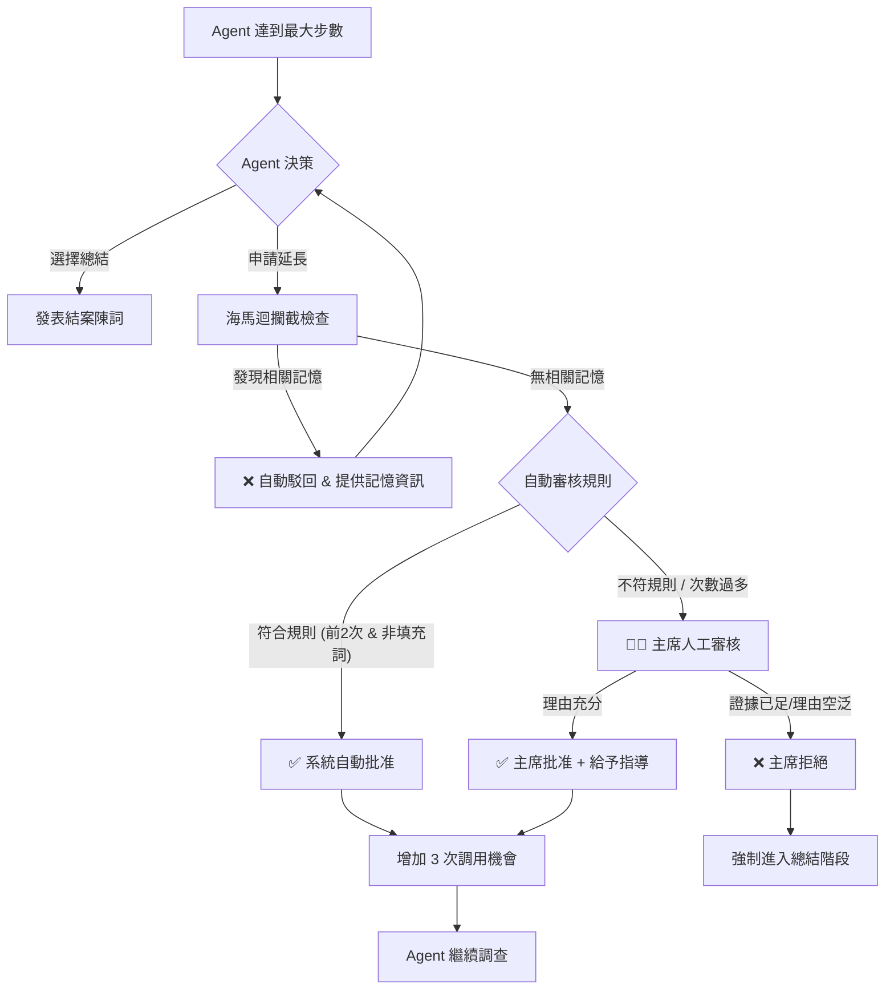

# 主席延伸調查機制 (Chairman Extended Investigation)

本文檔詳細說明了 AI 辯論平台中的「延伸調查 (Extended Investigation)」機制。此機制旨在解決辯手 (Agent) 因工具調用次數限制而無法完成深入調查的問題，同時在 API 成本與辯論深度之間取得平衡。

---

## 1. 核心邏輯概覽

當辯手 (Debater Agent) 在一輪發言中耗盡了基礎工具調用次數（預設 5 次）卻仍未完成調查時，系統不會直接強制結束，而是給予其 **申請延長** 的機會。

這個過程經過三道關卡的嚴格審核：

1.  **海馬迴攔截 (Hippocampal Interception)**：檢查共享記憶庫，看是否有現成答案。
2.  **自動審核 (Auto-Approve)**：系統規則過濾，防止無意義或重複申請。
3.  **主席裁決 (Chairman Review)**：LLM 根據戰略手卡進行最終判斷。

---

## 2. 完整工作流程 (Workflow)

### 2.1 觸發條件 (Trigger)
當 Agent 的工具調用次數 (`current_step`) 達到上限 (`MAX_AGENT_TOOL_STEPS`，預設 5) 時，系統會暫停 Agent 的行動，並發送一個特殊的 System Prompt：
> "Max steps reached. 1. Conclude (總結). 2. Extend (申請延長)."

Agent 若認為資料不足，會調用特殊工具 `request_extension` 並附上理由。

### 2.2 第一道關卡：海馬迴攔截 (Hippocampal Interception)
系統首先檢查 **共享記憶庫 (Shared Hippocampus)**，看看是否有其他 Agent 或是歷史辯論中已經查過類似的問題。

*   **邏輯**：使用 Agent 的「申請理由」作為 Query 進行語義檢索 (`search_shared_memory`)。
*   **結果**：
    *   **命中 (Hit)**：若發現相關的高信賴度資訊，系統會**自動駁回**延長申請，並直接將查到的記憶內容灌輸給 Agent。
        > 訊息範例：「延長申請已駁回，因為在共享記憶中發現了相關資訊...請利用這些資訊繼續。」
    *   **未命中 (Miss)**：進入下一階段。

### 2.3 第二道關卡：系統自動審核 (Heuristic Auto-Approve)
為了減少 LLM (主席) 的調用成本，系統設有一套規則式 (Rule-based) 的自動放行機制。

*   **前置條件**：
    *   僅在前 2 次延長申請有效。
    *   理由不能與上次重複。
*   **檢查規則**：
    1.  **實質性檢查 (Substantiality Check)**：理由不能太短，且不能只包含 "need time", "thinking" 等填充詞，必須包含具體的實體或數據需求。
    2.  **重複性檢查 (Loop Detection)**：理由不能與上一次申請完全相同。
*   **結果**：
    *   **通過**：系統日誌顯示 `System (Auto-Approve)`，直接增加 `EXTENSION_STEPS` (預設 3 次) 的額度。
    *   **未通過**：轉交主席人工審核。

### 2.4 第三道關卡：主席裁決 (Chairman Review)
這是最核心的決策層。系統將權限轉交給主席 Agent，由其判斷是否值得繼續投入資源。

*   **輸入資訊**：
    *   **申請理由**：Agent 填寫的 Reason。
    *   **證據摘要**：Agent 目前為止已蒐集到的所有證據 (Evidence Summary)。
    *   **賽前手卡**：主席在賽前分析階段生成的戰略指導 (Handcard)。

*   **主席的思考邏輯 (System Prompt)**：
    1.  **戰略相關性**：這個調查是否對釐清「關鍵交鋒點」有幫助？
    2.  **成本控制**：目前的證據是否已經足夠支持一個基本的論點？（若已足夠，則傾向拒絕）。
    3.  **指導性**：若批准，主席通常會附帶具體的「下一步指引 (Guidance)」。

*   **輸出結果 (JSON)**：
    ```json
    {
        "approved": true,
        "reason": "目前缺乏台積電 Q3 財報數據，此為核心論據，准許延長。",
        "guidance": "請直接使用 chinatimes 工具查詢最新財報新聞。"
    }
    ```

### 2.5 最終處置
*   **批准 (Approved)**：Agent 獲得額外步數，並收到主席的指導語。
*   **拒絕 (Rejected)**：系統強制進入總結階段 (`FORCE A CONCLUSION`)，Agent 必須根據手頭現有的殘缺資訊進行發言。

---

## 3. 流程圖 (Flowchart)



---

## 4. 程式碼實作參考

相關邏輯主要實作於 `worker/debate_cycle.py` 的 `_agent_turn_async` 方法中，以及 `worker/memory.py` 的 `HippocampalMemory` 類別。

*   **自動審核邏輯**: `worker/debate_cycle.py` (lines ~1945)
*   **主席審核 Prompt**: `prompts/system/chairman_review_extension.yaml`
*   **海馬迴檢索**: `worker/memory.py` -> `search_shared_memory`

---

## 5. 主席賽後延伸調查 (Chairman Post-Debate Extended Research)

**注意：** 系統中還存在另一種名為「延伸調查」的機制，發生在**辯論結束後**，由**主席**親自執行。請勿與上述 Agent 的申請延長混淆。

### 5.1 目的
這是一個「賽後加值服務」。當辯論得出結論後，主席為了讓報告更具**可執行性 (Actionable)**，會主動進行額外的網路搜索，補充辯論中可能忽略的實操細節。

### 5.2 執行流程
代碼位置：`worker/chairman.py` -> `_conduct_extended_research`

1.  **規劃問題**：
    主席根據最終裁決 (Verdict)，調用 LLM 生成 3 個具體的行動導向問題。
    > 範例：「如何下載 ETF 持股清單？」、「哪裡可以查看最新產業報告？」

2.  **執行搜索**：
    主席直接調用 `searxng.search` 工具進行廣泛搜索，獲取最新資訊。

3.  **整合建議**：
    將搜索結果整合進最終的「行動建議 (Actionable Advice)」章節，提供用戶明確的下一步指引。

### 5.3 區別對照表

| 特徵 | 辯手延伸調查 (Debater Extension) | 主席延伸調查 (Chairman Research) |
| :--- | :--- | :--- |
| **執行者** | 辯手 (Pro/Con/Neutral Agents) | 主席 (Chairman Agent) |
| **時機** | 辯論進行中 (回合內) | 辯論結束後 (總結階段) |
| **觸發條件** | 工具次數用盡，資料不足 | 自動觸發，為了增強建議的可操作性 |
| **目的** | 完成論點支撐 | 提供用戶實操指引 (Actionable Advice) |
| **工具** | Agent 已裝備的專業工具 | `searxng.search` (廣泛搜索) |