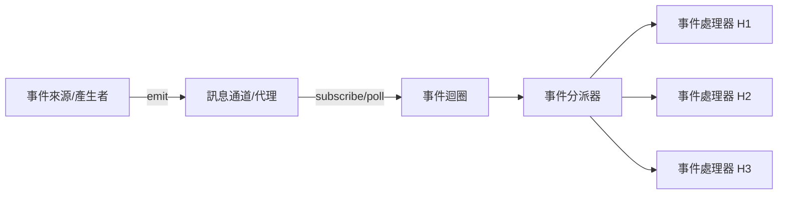
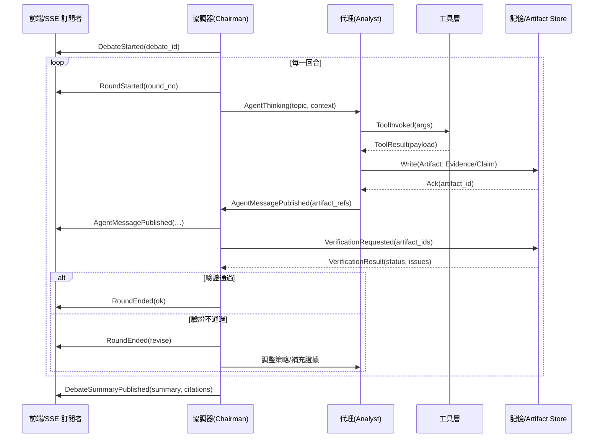
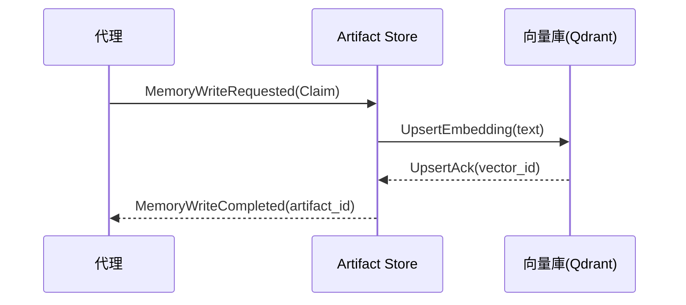

# 事件驅動程式設計（Event-driven Programming）

事件驅動程式設計是一種以「事件」為核心的電腦編程範型。系統透過偵測外部或內部事件（如使用者操作、訊息到達、計時器觸發、IO 完成等），由事件迴圈（event loop）分派對應的事件處理器（handler/callback）執行邏輯。此模式廣泛用於 GUI、網路服務、即時資料處理、分散式系統與微服務架構。

—

## 1. 核心概念
- 事件（Event）
  - 系統狀態變化的訊號，例如：HTTP 請求、訊息佇列中的新訊息、文件寫入完成、使用者點擊、定時器到期。
- 事件來源／產生者（Event Source/Emitter）
  - 發出事件的元件，如 Web 伺服器、訊息代理（Redis、RabbitMQ、Kafka）、OS IO 通知、瀏覽器。
- 事件處理器（Event Handler / Callback）
  - 對事件做出回應的函式或物件，負責執行相對應業務邏輯。
- 事件迴圈（Event Loop）
  - 監聽事件並分派工作的主迴圈；常見於 JavaScript（Node.js）與 Python asyncio。
- 訊息通道（Message Channel / Bus）
  - 用來傳遞事件資料的媒介，如 Redis Pub/Sub、Kafka topic、AMQP queue、WebSocket/SSE。

—

## 2. 典型架構



- 事件來源可為外部請求、排程器、資料流管道
- 訊息通道負責解耦與緩衝
- 事件迴圈與分派器執行對應處理器

—

## 3. 在本專案的應用（對照）
- Redis Pub/Sub 與 SSE（Server-Sent Events）
  - 檔案：`worker/debate_cycle.py` 內 `_publish_log` 以 `debate:{debate_id}:log_stream` 發布事件；前端透過 SSE 訂閱並即時顯示。
- 多代理辯論（Debate）
  - 由主席/協調器驅動輪次，代理（分析師/交易員/經濟學家等）於其回合觸發工具查詢、產出觀點，再由系統發布事件更新前端。
- 記憶（Memory）
  - 短期：回合／任務上下文，用於當前推理（例：最新發言、工具結果）
  - 長期：以 Artifact 與向量庫（Qdrant）儲存可重用知識（例：證據、主張、模型輸出），供後續檢索
- 工具治理（Tool Governance）
  - 工具輸入／輸出 Schema 驗證、速率限制、退避策略、Sanity Check、斷路器

—

## 4. 辯論（Debate）事件與流程

### 4.1 事件流概觀
- DebateStarted：建立對話序列與狀態
- RoundStarted / RoundEnded：開啟／結束一個回合
- AgentThinking：代理正在思考（可附帶計畫節點與上下文）
- ToolInvoked / ToolResult：工具呼叫與回傳
- AgentMessagePublished：代理的結構化輸出（可為文本或 Artifact）
- VerificationRequested / VerificationResult：驗證請求與結果
- DebateSummaryPublished：綜整／決策輸出（包含引用之 Artifact）

### 4.2 辯論回合序列圖（Mermaid）


### 4.3 事件契約（範例）
- AgentMessagePublished
```json
{
  "type": "AgentMessagePublished",
  "debate_id": "f997e5c8-...",
  "round": 1,
  "agent": "Innovation_Believer",
  "trace_id": "...",
  "payload": {
    "text": "短期 AI 估值修正...",
    "artifact_refs": ["claim:123", "evidence:abc"],
    "confidence": 0.72
  },
  "ts": "2025-12-13T03:25:00Z"
}
```

—

## 5. 記憶（Memory）詳細設計

### 5.1 記憶分層
- 短期記憶（Short-term Memory）
  - 範圍：單個辯論／回合上下文（最近語境、最新工具結果、候選主張）
  - 儲存：記憶面板（in-memory/Redis），具有回合 TTL；回合結束可選擇下沉為 Artifact
  - 用途：高即時性、低持久性，直接支援當前推理
- 長期記憶（Long-term Memory）
  - 範圍：跨辯論／跨任務知識（穩定事實、可重用證據、驗證過的主張）
  - 儲存：Artifact Store（SQLite/DB 之 metadata + Qdrant 向量）；保留 provenance（來源、工具、trace）
  - 用途：檢索輔助（RAG），提供證據與範例，強化可重現性

### 5.2 Artifact 與溯源
- EvidenceDoc：{source, snippet, timestamp, tool, citation, provenance, embedding}
- Claim：{text, evidence_ids[], confidence, assumptions, scope, provenance}
- Counterclaim：{target_claim_id, evidence_ids[], provenance}
- ModelResult：{inputs, outputs, params, metrics, provenance}
- Summary/Decision：{inputs[], claim_ids[], caveats[], confidence, provenance}
- 溯源（provenance）：{agent, tool, inputs_hash, outputs_hash, run_id, ts}

### 5.3 記憶事件與流程
- MemoryWriteRequested → MemoryWriteCompleted / MemoryWriteFailed
- MemoryReadRequested → MemoryReadResult（含相似度排序與濾除過期）
- MemoryTTLExpired → RevalidateScheduled（對重要 Artifact 排程再驗證）

#### 記憶寫入序列圖


### 5.4 記憶讀取與檢索策略
- 讀取策略
  - 先短期後長期：先檢索回合內暫存，再查詢長期 Artifact
  - 過期濾除：對市場價格/新聞類 Evidence 設定較短 TTL；逾期標記並優先 revalidate
- 檢索範例事件
```json
{
  "type": "MemoryReadRequested",
  "debate_id": "f997e5c8-...",
  "round": 1,
  "agent": "Technical_Analyst",
  "query": "TSMC ADR 下跌 驅動因素",
  "filters": {"type": ["EvidenceDoc", "Claim"], "ttl_ok": true},
  "top_k": 8,
  "ts": "2025-12-13T03:28:00Z"
}
```

—

## 6. 工具治理（Tool Governance）
- I/O Schema 驗證：所有工具呼叫前後依 JSON Schema 驗證
- 退避與重試：exponential backoff + jitter，限制最大重試次數
- 後驗 Sanity Check：數值/日期格式與範圍校驗、空值保護、錯誤頁檢測
- 速率限制：per-tool、per-agent；超額則排隊或降級
- 斷路器：對重複失敗與無效「工具重置」行為觸發告警與阻斷，要求 Planner 調整策略

—

## 7. 可觀測性與重現
- 結構化 Trace 欄位：agent、tool、plan_node_id、inputs_hash、outputs_hash、tokens、latency_ms、retries、verification_status、errors
- Run 報表：計畫節點完成情況、Artifact 列表與 Graph、驗證成績、工具錯誤分佈
- SSE 日誌：對使用者顯示友好的事件摘要（已加入去重與節流），並保留詳細 trace 於檔案/資料庫

—

## 8. 設計準則與最佳實務
- 事件模型：明確命名、版本、Schema；加上 trace_id/run_id 以關聯呼叫鏈
- 處理器：輸入驗證、冪等、明確錯誤類型標記，可重試與補償流程（SAGA）
- 記憶策略：短期高即時低持久；長期高可重用並具 TTL 與 revalidate 機制
- 驗證優先：對關鍵 Claim 需 ≥2 證據來源與新鮮度檢查；未過閾值不得進入綜整

—

## 9. 實作範例（節選）

### 9.1 Python（asyncio + Redis Pub/Sub）
```python
import asyncio
import aioredis

CHANNEL = "debate:demo:log_stream"

async def publisher():
    redis = aioredis.from_url("redis://localhost")
    await redis.publish(CHANNEL, {
        "type": "AgentMessagePublished",
        "payload": {"text": "短期 AI 估值修正…"}
    })

async def subscriber():
    redis = aioredis.from_url("redis://localhost")
    pubsub = redis.pubsub()
    await pubsub.subscribe(CHANNEL)
    async for msg in pubsub.listen():
        if msg.get("type") == "message":
            print("[SSE]", msg.get("data"))

async def main():
    await asyncio.gather(subscriber(), publisher())

if __name__ == "__main__":
    asyncio.run(main())
```

### 9.2 記憶檢索（偽碼）
```python
def retrieve_context(query: str, round_ctx, store):
    # 先短期
    short_hits = round_ctx.search(query, top_k=5)
    # 再長期（向量檢索 + TTL 過濾）
    long_hits = store.vector_search(query, filters={"ttl_ok": True}, top_k=10)
    return merge_rank(short_hits, long_hits)
```

—

## 10. 測試與除錯
- 單元測試：事件處理器、工具 I/O 驗證、Sanity Check、斷路器
- 整合測試：端到端（辯論回合 → 工具 → 記憶寫入 → 驗證 → 綜整）
- 壓力測試：觀察吞吐/延遲；調整併發與批量
- 指標：成功率、重試次數、失敗分類、平均延遲、P95/P99、驗證通過率

—

## 11. 在本專案可立即落地的改進
- 辯論事件契約：補齊 AgentThinking、ToolInvoked、VerificationResult、DebateSummaryPublished 之 Schema 定義
- 記憶策略：導入短期/長期分層與 TTL；重要 Artifact 到期自動排程再驗證
- 觀測：為每個事件加入 trace_id/run_id；Run 報表聚合顯示
- 工具治理：完善 Schema 驗證、退避、Sanity Check、速率限制與斷路器

—

## 12. 參考
- Anthropic: Multi-Agent Research System（MARS）
- Martin Fowler: Event-Driven Architecture
- Reactive Systems, CQRS/ES（Command Query Responsibility Segregation / Event Sourcing）
