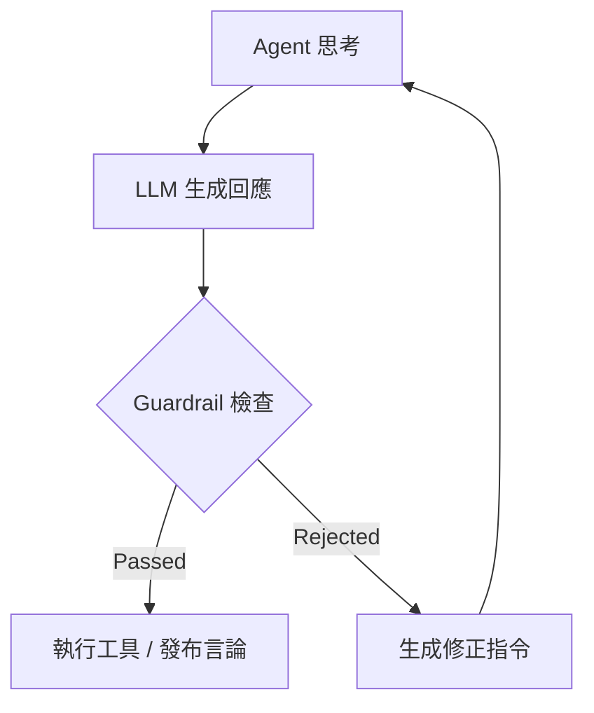

# Guardrail & Base Contract Implementation Plan

本文件詳述如何將「制度化 Prompt (Base Contract)」與「Guardrail Agent」整合至現有的 `DebateCycle` 中。

## 目標 (Objectives)

1.  **統一繼承**: 確保所有 Agent (含 Chairman) 的 System Prompt 都包含 `base_contract.yaml` 定義的行為邊界。
2.  **即時攔截**: 在 Agent 發言進入正式紀錄前，通過 Guardrail Agent 審核。
3.  **閉環修正**: 若審核失敗，將修正指令回饋給 Agent 進行重試，而非直接中斷流程。

## 1. 架構變更 (Architecture Changes)

### A. Prompt 繼承機制 (Base Prompt Injection)

**現狀**: `DebateCycle._agent_turn_async` 中手動拼接 Prompt 字串。
**變更**: 引入 `PromptComposer` 或修改 `PromptService`，強制在所有 System Prompt 頂部注入 `Base Contract`。

```python
# 偽代碼示例
base_contract = load_yaml("prompts/system/base_contract.yaml")
system_prompt = f"""
{base_contract['institution']['principle']}

{format_contract(base_contract['contract'])}

# 你的角色設定
{agent_persona}
"""
```

### B. 新增 Guardrail Agent

**新增檔案**: `worker/guardrail_agent.py`
**職責**:
- 繼承 `AgentBase`。
- 專門執行 `prompts/agents/guardrail.yaml` 定義的檢查邏輯。
- 輸出結構化 JSON (Passed/Rejected)。

### C. Debate Cycle 流程改造

在 `_agent_turn_async` 的 LLM Response 之後插入檢查點：



## 2. 實作步驟 (Step-by-Step Implementation)

### Phase 1: 基礎設施 (Infrastructure)
- [ ] **Task 1.1**: 實作 `PromptLoader`，支援讀取與解析 `base_contract.yaml`。
- [ ] **Task 1.2**: 修改 `PromptService`，新增 `compose_system_prompt(agent_role, base_contract)` 方法。
- [ ] **Task 1.3**: 實作 `worker/guardrail_agent.py` 及其 `check(content, context)` 方法。

### Phase 2: 整合至 Debate Cycle
- [ ] **Task 2.1**: 在 `DebateCycle.__init__` 初始化 `self.guardrail_agent`。
- [ ] **Task 2.2**: 修改 `_agent_turn_async`，在取得 LLM Response 後調用 Guardrail。
- [ ] **Task 2.3**: 實作「重試迴圈 (Retry Loop)」。若 Guardrail 返回 `REJECTED`，將 `correction_instruction` 附加到下一次 Prompt 中 (最多重試 2 次)。

### Phase 3: 觀測與日誌 (Observability)
- [ ] **Task 3.1**: 新增 Redis Log Channel `guardrail:audit`，專門記錄審核通過/拒絕事件。
- [ ] **Task 3.2**: 在最終報告 (`_save_report_to_file`) 中新增「合規性報告」章節，統計被攔截次數。

## 3. 風險控制 (Risk Mitigation)

- **延遲風險**: Guardrail 會增加 LLM 調用次數。
  - *對策*: 僅對「關鍵結論」或「工具調用參數」進行完整檢查，一般對話可採抽樣檢查或輕量級規則 (Regex)。
- **誤殺風險**: Guardrail 過於嚴格導致死循環。
  - *對策*: 設定 `MAX_RETRY = 2`。若連續失敗，強制降級為 `WARNING` 並放行，但在 Log 中標記風險，供人工後續檢視。

## 4. 驗收標準 (Acceptance Criteria)

1. **System Prompt**: 任意 Agent 的 Debug Log 中必須看見 Base Contract 的內容。
2. **攔截測試**: 當 Agent 試圖輸出一串明顯的假數據 (Mock) 時，Guardrail 應返回 `REJECTED` 並指出 "No Fabrication"。
3. **流程恢復**: 收到修正指令後，Agent 能修正行為並通過第二次檢查。