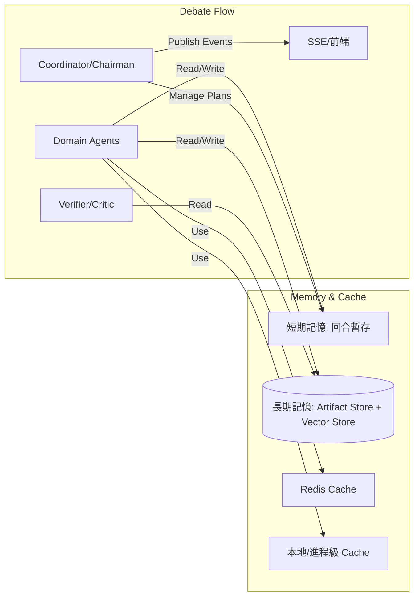
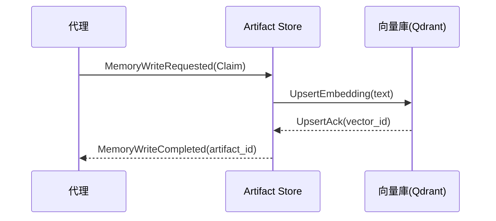

# 記憶與快取設計（Memory & Cache Design）

本文件說明本專案在多代理辯論流程中的「記憶（Memory）」與「快取（Cache）」設計與落地方案，並納入事件驅動（Event-driven）觀點、Artifact 中心化與治理策略，確保可重現性、可觀測性與高效能。

—

## 1. 目標（Goals）
- 提供分層記憶體系：支援回合級暫存（短期）與跨任務知識（長期）
- 以 Artifact 為中心存放可重用結果，具溯源（provenance）與檢索能力
- 針對工具查詢與資料拉取導入快取，降低重複 IO 與延遲
- 在事件驅動的辯論流程中，讓記憶/快取可被追蹤、校驗、過期與重建
- 提供清晰的治理策略（TTL、Eviction、一致性、重試/退避、斷路器）

—

## 2. 全域架構（High-level Architecture）



—

## 3. 記憶分層（Memory Layers）

### 3.1 短期記憶（Short-term Memory, STM）
- 目的：支援當前辯論回合/計畫的即時上下文
- 內容：最新的工具結果摘要、候選 Claim、待驗證清單、回合狀態
- 儲存：
  - In-memory 結構（協調器內部）
  - 可選 Redis（鍵含 debate_id、round_no）
- TTL：回合結束或任務完成後自動過期；必要時將重點下沉為 Artifact

### 3.2 長期記憶（Long-term Memory, LTM）
- 目的：跨任務可重用與可重現
- 內容：
  - EvidenceDoc、Claim、Counterclaim、ModelResult、Summary 等 Artifact
  - 向量嵌入（embedding）供語義檢索
- 儲存：
  - Artifact Metadata：SQLite/SQLAlchemy（或 Postgres）
  - 向量庫：Qdrant（或 Milvus Lite）
- 溯源：{agent, tool, inputs_hash, outputs_hash, run_id, ts}
- TTL 與 Freshness：
  - 市場資料 Evidence：短 TTL（例如 1–7 天）
  - 基本面資料 Evidence：長 TTL（例如 30–180 天）
  - Claim：隨 Evidence TTL 追蹤；任一引用 Evidence 到期即列為需再驗證（revalidate）

—

## 4. Artifact 與檢索（Artifacts & Retrieval）

### 4.1 Artifact 型別（摘要）
- EvidenceDoc：{id, source, snippet, fulltext_ref, timestamp, tool, citation, provenance, embedding}
- Claim：{id, text, evidence_ids[], confidence, assumptions[], scope, provenance}
- Counterclaim：{id, target_claim_id, text, evidence_ids[], provenance}
- ModelResult：{id, inputs, outputs, params, metrics, provenance}
- Summary/Decision：{id, inputs[], claim_ids[], caveats[], confidence, provenance}

### 4.2 檢索策略
- 先 STM 後 LTM：避免重複查詢，優先使用回合內最新上下文
- LTM 檢索以向量相似度排序，並套用 TTL/Freshness 過濾
- 檢索結果需帶上 provenance 以便追蹤

—

## 5. 快取層（Cache Layers）

### 5.1 進程級快取（Local/In-process Cache, LPC）
- 目的：降低同一進程內的重複計算/請求
- 適合：純函式計算結果、短期工具結果、Schema 校驗與 Prompt 模板
- 失效：
  - 時間式（TTL）
  - 事件式（資料更新事件）

### 5.2 Redis 快取（RC）
- 目的：多進程/多服務共享的快取層
- 適合：
  - 工具結果（例如相同 Query 的搜索/報價）
  - SSE 訂閱與事件廣播（Pub/Sub）
- 失效與一致性：
  - 按工具定義 TTL（市場資料請求較短）
  - 以 Key 命名（tool:hash(args)）避免碰撞
  - 重要資料可加入 ETag/版本號

—

## 6. 事件驅動與記憶/快取（Event-driven Integration）

### 6.1 重要事件（摘要）
- DebateStarted、RoundStarted/Ended
- AgentThinking、AgentMessagePublished
- ToolInvoked、ToolResult
- MemoryWriteRequested/Completed/Failed
- MemoryReadRequested/Result
- VerificationRequested/Result
- CacheHit/CacheMiss、CacheInvalidated

### 6.2 記憶寫入序列（Mermaid）


—

## 7. 工具治理與快取策略（Governance）
- I/O Schema 驗證：工具呼叫前後驗證；不合格不入快取與記憶
- 退避/重試：exponential backoff + jitter；失敗結果不覆蓋快取
- 後驗 Sanity Check：數值/日期/空值/錯頁檢查；不合格不入庫
- 速率限制：per-tool、per-agent；超額排隊或降級
- 斷路器：偵測重複失敗與 meta-tool reset 風暴；觸發告警與策略改寫

—

## 8. 一致性與失效（Coherence & Invalidation）
- TTL 與事件驅動失效：
  - 依資料型別定義 TTL（市場資料短、基本面長）
  - 重要資料更新事件（例如官方 API 宣佈更新）觸發快取失效/更新
- 原子寫入與對齊：
  - Artifact metadata 與向量嵌入需具備事務對齊（先寫元資料後寫向量，失敗則回滾）
- Idempotency（冪等）：
  - 重複寫入同一 Artifact（以 hash 判定）不應造成重複

—

## 9. 可觀測性（Observability）
- Trace 欄位：agent、tool、plan_node_id、inputs_hash、outputs_hash、tokens、latency_ms、retries、verification_status、errors
- 指標：快取命中率、平均延遲、P95/P99、TTL 到期重建次數、驗證通過率
- 日誌節流與去重：避免 UI 刷屏（已在 `_publish_log` 內導入）

—

## 10. API/介面（Pseudo）

### 10.1 STM 介面
```python
class ShortTermMemory:
    def put(self, debate_id: str, round_no: int, key: str, value: Any, ttl_s: int) -> None: ...
    def get(self, debate_id: str, round_no: int, key: str) -> Optional[Any]: ...
    def evict_round(self, debate_id: str, round_no: int) -> None: ...
```

### 10.2 LTM 介面（Artifact Store）
```python
class ArtifactStore:
    def upsert_artifact(self, artifact: Artifact) -> str: ...
    def get_artifact(self, artifact_id: str) -> Artifact: ...
    def search(self, query: str, filters: dict, top_k: int) -> List[Artifact]: ...
    def schedule_revalidate(self, artifact_id: str) -> None: ...
```

### 10.3 Cache 介面
```python
class Cache:
    def get(self, key: str) -> Optional[Any]: ...
    def set(self, key: str, value: Any, ttl_s: int) -> None: ...
    def invalidate(self, key: str) -> None: ...
```

—

## 11. 落地步驟（Roadmap）
- Phase 1：
  - 建立 artifacts.py 與 artifact_store.py（SQLite + Qdrant）
  - 實作 STM（in-memory + 選用 Redis）
  - 工具治理：Schema 驗證、退避、Sanity Check、速率限制、斷路器
- Phase 2：
  - 將辯論回合切入 Plan→Execute→Critique，Verifier Gate 與記憶寫入打通
  - 檢索策略落地：先 STM 後 LTM + TTL 過濾
- Phase 3：
  - 優化可觀測性：Run 報表、快取命中率儀表、TTL 重建隊列
  - 自動再驗證任務（到期 Artifact 排程）

—

## 12. 檢查清單（Checklist）
- [ ] 定義 Artifact schema 與 provenance 欄位
- [ ] 實作 Artifact Store（DB + 向量庫）
- [ ] 導入 STM 與回合 TTL 策略
- [ ] 為主要工具定義 I/O Schema 與快取 TTL
- [ ] 實作退避/重試、Sanity Check、斷路器
- [ ] 建立檢索流程（STM→LTM；TTL 過濾）
- [ ] 加強 Trace 與 Run 級報表

—

## 13. 附錄（事件樣板）

### 13.1 MemoryReadRequested（樣板）
```json
{
  "type": "MemoryReadRequested",
  "debate_id": "<uuid>",
  "round": 1,
  "agent": "Technical_Analyst",
  "query": "TSMC ADR 下跌 驅動因素",
  "filters": {"types": ["EvidenceDoc", "Claim"], "ttl_ok": true},
  "top_k": 8,
  "trace_id": "<trace>",
  "ts": "2025-12-13T03:28:00Z"
}
```

### 13.2 CacheResult（樣板）
```json
{
  "type": "CacheResult",
  "key": "tool:searxng:sha256(args)",
  "hit": true,
  "ttl_remaining_s": 420,
  "trace_id": "<trace>",
  "ts": "2025-12-13T03:30:00Z"
}
```
