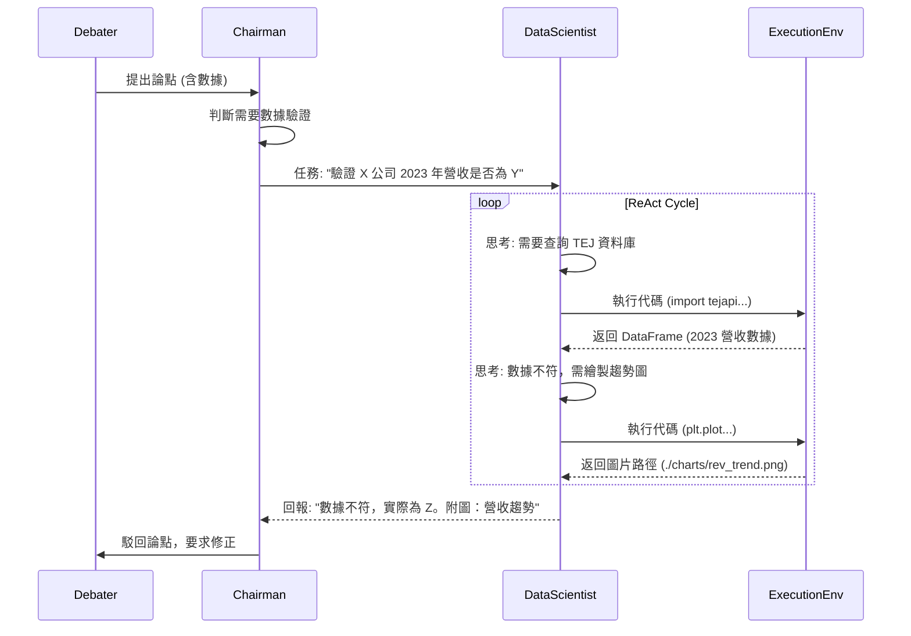

# Open Data Scientist - Internal System Design & Integration Plan

## 1. 簡介

本文件定義了如何將 **Open Data Scientist (ODS)** 的核心能力（ReAct 推理、Python 程式碼執行、數據分析）整合進 Agentscope Debate 系統，作為一個專門的「數據科學家 Agent」。此設計旨在提供一個安全、可擴展且能產生高品質分析報告的數據輔助角色，支援辯論過程中的數據佐證需求。

---

## 2. 系統架構

### 2.1 核心組件

```mermaid
graph TD
    User[辯手 Agent / 主席 Agent] -->|數據請求 (Query)| ODS[DataScientistAgent]
    
    subgraph ODS_Internal [Data Scientist Agent 內部]
        ReAct[ReAct 推理引擎] -->|生成程式碼| Sandbox[Python 沙箱環境]
        Sandbox -->|執行結果/錯誤| ReAct
        ReAct -->|自我修正/下一步| ReAct
    end
    
    ODS -->|最終報告 (Text + Charts)| User
    
    subgraph External_Resources [外部資源]
        TEJ[TEJ API]
        OpenData[Open Data Source]
    end
    
    Sandbox -.->|數據獲取| External_Resources
```

### 2.2 角色職責

| 角色 | 職責描述 |
|------|----------|
| **DataScientistAgent** | 接收自然語言查詢，轉化為數據分析任務，生成並執行 Python 程式碼，最終產出分析報告。 |
| **PythonToolAdapter** | 提供安全的程式碼執行環境，攔截並處理繪圖請求，管理依賴庫。 |
| **Chairman** | 識別辯論中的數據需求，將任務分派給 DataScientistAgent，並驗收報告品質。 |

---

## 3. 詳細設計

### 3.1 DataScientistAgent (`worker/data_scientist.py`)

繼承自基礎 Agent，但具備特殊的 `reply` 邏輯以實作 ReAct 循環。

- **System Prompt**: 強調其作為數據科學家的身份，要求其必須透過編寫程式碼來回答問題，而非依賴內部知識。
- **ReAct Loop**:
    1.  **Thought**: 分析問題，決定下一步行動（寫程式、搜尋數據、結束任務）。
    2.  **Action**: 生成 Python 程式碼區塊。
    3.  **Observation**: 接收程式碼執行結果（stdout, stderr, 圖片路徑）。
    4.  **Repeat**: 根據執行結果進行修正或進一步分析，直到得出結論。

### 3.2 Python 執行環境 (Sandbox)

採用 **本地 Docker 容器** 方案以確保隔離性與一致性。

- **映像檔**: 基於官方 Python 映像檔，預裝 `pandas`, `numpy`, `matplotlib`, `seaborn`, `scikit-learn`, `requests`, `rich` 等常用庫。
- **掛載**: 掛載一個臨時目錄用於輸出圖片與報告檔案。
- **安全性**: 限制網路存取（僅允許白名單 API，如 TEJ），限制執行時間與記憶體用量。

### 3.3 輸出格式規範

ODS 的最終輸出必須包含兩部分：

1.  **執行摘要 (Executive Summary)**: 針對問題的直接回答，使用自然語言。
2.  **分析報告 (Analysis Report)**: 
    - 數據來源說明
    - 分析方法
    - 關鍵發現
    - **圖表連結**: 引用生成的圖表檔案 (Markdown 格式: ``)

---

## 4. 整合流程

### 4.1 觸發場景

1.  **辯手主動請求**: 辯手在建構論點時，透過工具調用請求「查詢 X 公司的獲利趨勢」。
2.  **主席被動觸發**: 主席在審核辯論時，發現某方數據存疑，指派 ODS 進行「驗證 Y 數據的真實性」。

### 4.2 互動序列圖



---

## 5. 實作計畫 (Implementation Plan)

### 階段 1：基礎設施與 Agent 原型 (Must Have)
- [x] **建立 `worker/data_scientist.py`**:
    - 移植 `ReActDataScienceAgent` 核心邏輯。
    - 實作基於 AgentScope 的通訊介面。
- [x] **開發 Python Sandbox**:
    - 建立 `docker/Dockerfile.ods`。
    - 實作 `adapters/docker_adapter.py` 管理容器生命週期。

### 階段 2：工具增強與安全性 (Should Have)
- [x] **升級 `PythonToolAdapter`**:
    - 實作 Matplotlib 圖片攔截 (Patch `plt.show` / `plt.savefig`)。
    - 優化 Pandas DataFrame 輸出格式 (使用 Rich 或 Markdown)。
- [ ] **安全機制**:
    - 限制 API 請求的白名單 (TEJ, Open Data Portals)。
    - 設定 Resource Limits (CPU/Memory)。

### 階段 3：辯論流程整合 (Could Have)
- [x] **修改 Chairman 邏輯**:
    - 增加 prompt 以識別「需要數據驗證」的場景。
    - 實作任務分派與結果驗收邏輯。
- [x] **驗證測試**:
    - 建立端對端測試案例 (例如：「驗證台積電過去五年營收成長率」)。

## 6. 技術限制與風險

- **執行延遲**: Docker 啟動與程式碼執行可能耗時較長，需設定合理的 Timeout (建議 60s)。
- **幻覺風險**: 模型可能生成錯誤的 API 呼叫或不存在的庫函數，需透過 ReAct 的自我修正機制緩解。
- **數據隱私**: 若涉及敏感數據，需確保 Docker 容器執行後完全銷毀數據。
